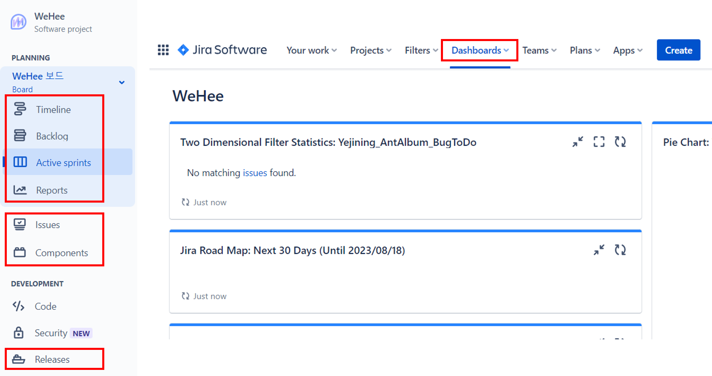
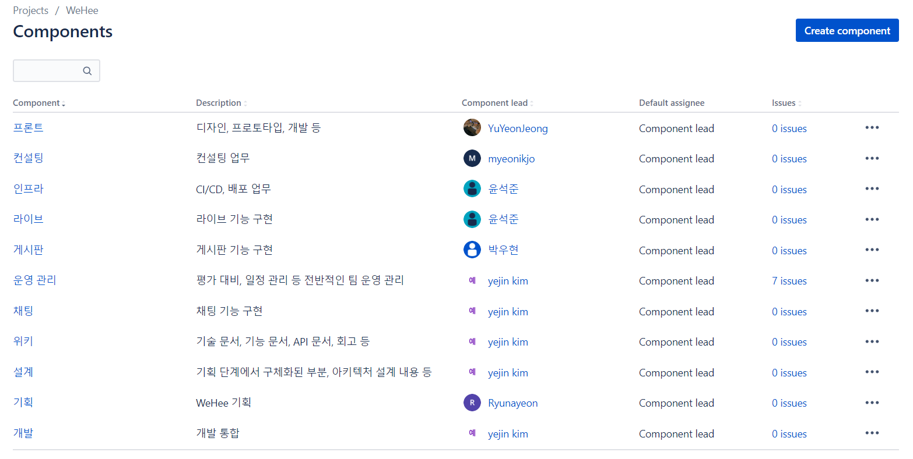
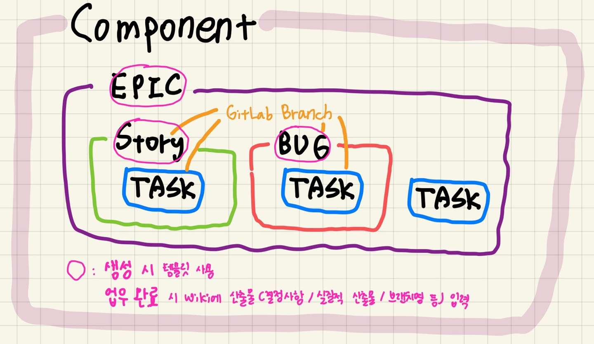

# Jira Conventions 세미나

작성일: 2023-08-25 <br>
작성자: 김예진

> **목차**
>
> 1. [Jira에서 사용할 기능들](#jira에서-사용할-기능들)
> 2. [Components 사용](#components-사용)
>    1. [Component별 이슈 관리](#component별-이슈-관리)
> 3. [Issue를 활용한 프로젝트 관리](#issue를-활용한-프로젝트-관리)
>    1. [Epic, Story 사용 - 생성 권한, 역할](#epic-story-사용---생성-권한-역할)
>    2. [Task Issue 관리](#task-issue-관리)
>    3. [Issue 깊이 관리](#issue-깊이-관리)
> 4. [Sprint 사용](#sprint-사용)

# Jira에서 사용할 기능들



### 스케줄 관리

1. Issues → Timeline, Backlog, Active sprints
   - 이슈의 종류(Epic, Story, Bug, Task)를 이용해 스케줄 및 업무 관리 수행

### 업무 관리

1. Components - 업무 단위로 이슈 관리
2. Jira-GitLab Integration 기능 - 이슈 및 브랜치 관리

# Components 사용



Components는 구체적인 업무 단위로 이슈들을 묶는 역할을 수행합니다. 각 component에는 리더가 배정되어 있으며, 실제로 프로젝트를 진행하실 때 리드 역할을 수행해주시고 일정 및 산출물까지 관리해주시면 됩니다. Component는 가장 큰 업무 단위이므로, 새로운 compoent 생성 시 모든 팀원에게 공유해주시며 됩니다. 현재 설계한 components는 모든 팀원들이 적어도 한 개 이상의 component를 가지고 있기 때문에 오늘 실습도 이 component를 기준으로 진행됩니다.

이 작업을 원할하게 수행하려면 **모든 이슈 생성 시 component를 설정**해주시면 됩니다.

## Component별 이슈 관리


Components 페이지에서 각 컴포넌트마다 `Issues` 버튼을 누르면 다음과 같은 화면으로 전환됩니다. 여기에서는 각 component별로 이슈를 한눈에 볼 수 있으며, 위의 JQL을 이용해 더 자세하게 이슈들을 트래킹할 수 있습니다.

# Issue를 활용한 프로젝트 관리


다음은 Issue 사용에 대한 대략적인 설계 그림입니다. 업무는 component 단위로 진행되며, Epic 단위로 세부적으로 업무를 쪼개 프로젝트를 관리합니다. 각 Epic은 Story, Bug, Task 등을 하위로 가집니다.

## Epic, Story 사용 - 생성 권한, 역할

**Epic과 Story는 각 component 리더가 작성합니다**. 비교적 큰 업무 단위를 관리하는 만큼 Epic과 Story는 생성 시 템플릿을 사용해 작성하고, 작성 완료 후 스크럼 미팅에서 모든 팀원들에게 해당 내용을 공유합니다. 업무 완료 시에는 wiki에 산출물을 업로드합니다. 여기에서의 산출물은 결정사항, 실질적인 산출물(pdf, pptx, 피그마 등), 브랜치명 등을 모두 포함합니다. 완료 시에도 팀원들에게 해당 내용을 공유합니다.

### Epic, Story 템플릿

```markdown
# ㅇㅇㅇ 필요성
내용

# 목표
- ㅇㅇ
- ㅇㅇ

# 산출물
산출물 내용

# 계획
- 2023-07-19
  - ㅇㅇ
- 2023-07-20
  - ㅇㅇ
```


## Task Issue 관리

Task는 component 리더가 아니더라도 자유롭게 생성 가능하고 self assign 하셔도 됩니다. 지정된 템플릿 사용 없이 자유롭게 사용하면 됩니다만, 효과적인 업무 파악을 위해 **제목에서 모든 것을 알 수 있게** 작성해주시면 좋겠습니다.

## Issue 깊이 관리



모든 종류의 이슈는 한 번 발행하고 나면 child 이슈를 무한정으로 생성할 수 있습니다. 하지만 저희는 **Issue depth를 Epic과 Story에 한해서만 허용**합니다!! Epic을 생성하고, Epic의 하위에 Story와 Bug 이슈를 child issue로 생성할 수 있습니다. 하지만 Task 부터는 Epic 내부에 직접 추가해주시고, Story와 링크만 해주세요. Depth에 대한 제한을 두는 이유는 프로젝트 진행사항을 한눈에 확인하기 위함이자, 프로젝트 주기를 짧게 가져가기 위함이기도 합니다.

### Issue 링크 방법

 

다음은 한 Story에 링크된 이슈들입니다. 해당 Story는 에픽21 내부에 속해있으며, 태스크26과 태스크 27을 관리합니다.

# Sprint 사용

프로젝트 현황을 효율적으로 하기 위해 업무 주기를 1주로 짧게 설정하고 1주 단위로 sprint를 관리합니다. 유동적으로 계획을 짜고 수정하게 하기 위해 이슈를 생성하고 sprint에 할당하는 것은 현재 주차를 기준으롤 1주 후까지만 가능하게 했습니다.

Sprint는 **팀장이 작성**하고, 현재 주차와 다음 주차 sprint만 만들어 관리합니다.

## Active sprints


## Backlog


Backlog는 `To Do`, `In progress`, `Done` 세 개로 시각화해 이슈를 관리할 수 있습니다. 각 이슈는 assigned 된 담당자를 기준으로 띄워지게 설정했기 때문에 개인별 일정을 쉽게 파악할 수 있습니다. 인원과 이슈가 많아 한눈에 파악이 힘들어지는 경우, 위의 퀵필터를 적용해 쉽게 원하는 이슈만 찾아서 보실 수도 있습니다.