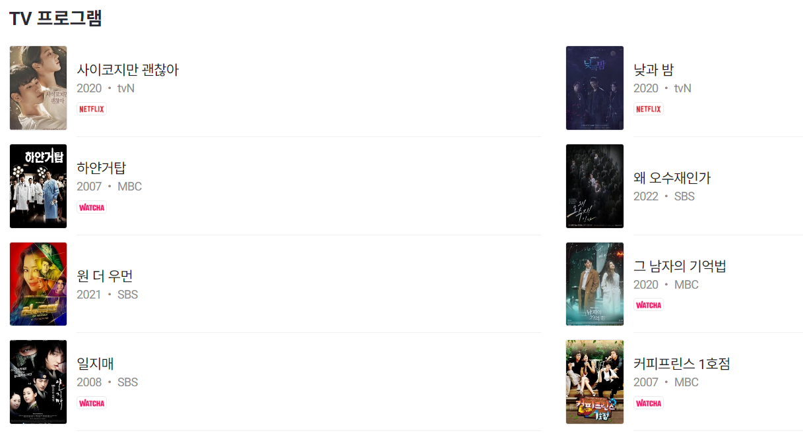
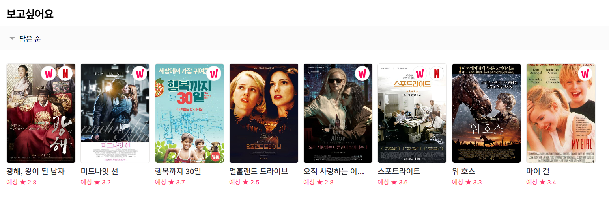
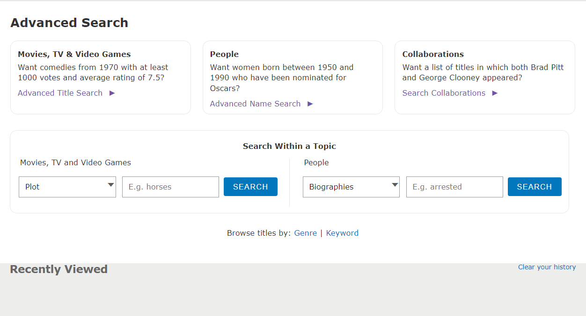

# 1차 인터뷰 정리 및 추가 자료 조사

마지막 업데이트 날짜: 2023-09-06

> **목차**
>
> 1. [주로 찾아보는 레퍼런스 페이지](#1-주로-찾아보는-레퍼런스-페이지)
>    1. [참고 사이트](#참고-사이트)
>    2. [한국 드라마 조사할 때](#한국-드라마-조사할-때)
>    3. [외국 드라마 조사할 때](#외국-드라마-조사할-때)
> 2. [아카이브에서 보고 싶은 것 (작품)](#2-아카이브에서-보고-싶은-것-작품)
>    1. [필터링](#필터링)
>    2. [정렬](#정렬)
>    3. [요구사항](#요구사항)
>    4. [기획 반영](#기획-반영)
> 3. [아카이브에서 보고 싶은 것 (인물, 주로 배우)](#3-아카이브에서-보고-싶은-것-인물-주로-배우)
> 4. [자료조사](#4-자료조사)
>    1. [왓챠피디아](#왓챠피디아)
>    2. [키노라이츠](#키노라이츠)
>    3. [IMDb 상세검색](#imdb-상세검색)

# 1. 주로 찾아보는 레퍼런스 페이지

## 참고 사이트

- [왓챠피디아](https://pedia.watcha.com/ko-KR/)
  - 외국 드라마 찾은 후 한국어 줄거리와 어디서 서비스되는지, 리뷰 보려고 사용하는 목적이 큼
  - 리스트 정보 보기에 가장 편함
- 키노라이츠
  - 왓챠피디아에서 서비스 표시 안되는 부분 다시 검색하는 용도로 사용
  - OTT 스트리밍 제공사 정보까지도 포함해서 알려주는 부분이 좋음
- IMDb
  - 외국 드라마 검색 시 사용
- 메타크리틱
  - 외국 드라마 검색 시 사용

## 한국 드라마 조사할 때

왓챠피디아 > 네이버

## 외국 드라마 조사할 때

IMDb > 메타크리틱 > 왓챠피디아 > 키노라이츠

# 2. 아카이브에서 보고 싶은 것 (작품)

## 필터링

장르별 > 제작진 > 배우 > 제작사 > 방송사

## 정렬

연도별

## 요구사항

- 모든 드라마가 한 페이지에 쭉 보여지면 좋겠다
- 연도별 정렬도 필요하다

## 기획 반영

- 장르를 줄이기보다 다양하게 보여주는 것이 더 좋을 것 같다
- 줄거리 컬럼에서도 다양한 키워드를 검색할 수 있으면 좋겠다
- 검색 결과 페이지에서 연도별로 드라마를 정렬하고 리스트를 한 눈에 볼 수 있게 보여주면 좋겠다
- 세부 정보에 OTT 순위나 화제성이 들어가면 편리할 것 같다.
- 외국 드라마?

## 찾아보면 좋을만한 것

- IMDb에서는 검색 필터링을 어떻게 지원하는지?
- 왓챠피디아는 리스트 정보를 어떻게 보여주는지?
- 왓챠피디아 보관함은 어떤 식으로 작품들을 보관하는지?

# 3. 아카이브에서 보고 싶은 것 (인물, 주로 배우)

- 나이, 성별이 가장 중요
  - 40대 여배우, 20대 초반 여배우 등
- 참고: 한국 영화 아카이브에서 배우 출생연도 필터링 되는 부분

# 4. 자료조사

## 왓챠피디아

### 김창완’ 검색 결과 리스트

### 상세 페이지

제목, 제작 년도, 채널, 장르, 제작 국가, 시청 가능 연령, OTT 제공사, (왓챠) 평균 별점, 줄거리, 출연/제작자, (왓챠) 코멘트, 갤러리, (왓챠) 이 작품이 담긴 컬렉션, (왓챠) 비슷한 작품

### 보고싶어요

## 키노라이츠

키노라이츠에서 ‘*왓챠피디아에서 서비스 표시 안되는 부분’*이 뭔지 잘 모르겠어서 물어본 상태

## IMDb 상세검색

- 상세 검색 주소: [IMDb 상세검색](https://www.imdb.com/search/?ref_=nv_sr_menu_adv)

### Advanced Search

| Advanced Title Search                                        | Advanced Name Search                                         | Search Collaborations                              |
| ------------------------------------------------------------ | ------------------------------------------------------------ | -------------------------------------------------- |
| Title (e.g. The Godfather)                                   | Name                                                         | Two People in the Same Title (Name 1, Name 2)      |
| Title Type (Feature Film,, TV Movie, TV Series, TV Episode…) | Birth Date                                                   | Two Titles with the Same People (Title 1, Title 2) |
| Release Date                                                 | BirthDay                                                     |                                                    |
| User Rating                                                  | Name Groups (Best Actress-Nominated, Best Actor-Winning, …)  |                                                    |
| Number of Votes                                              | Birth Place                                                  |                                                    |
| Genres                                                       | Death Date                                                   |                                                    |
| Title Groups (IMDB “Top 100”, Oscar-Winning, Emmy Award-Winning, …) | Death Place                                                  |                                                    |
| Title Data (Alternate Versions, Awards, Business Info, …)    | Gender Identity                                              |                                                    |
| Companies (20th Century Fox, Sony, …)                        | Filmography                                                  |                                                    |
| Instant Watch Options (US Prime Video, UK Prime Video, …)    | Biographies (Search for words that might appear in the Mini-Biography) |                                                    |
| US Certificates (G, PG, PG-13, R, NC-17)                     | Name Data (Awards, Biography, Birth Date, …)                 |                                                    |
| Color Info (Color, Black & White, Colorized, ACES, …)        | Adult Names                                                  |                                                    |
| Countries                                                    | (Display Options)                                            |                                                    |
| Keyword (Search for a notable object, concept, sytle or aspect) |                                                              |                                                    |
| Languages                                                    |                                                              |                                                    |
| Filming Locations                                            |                                                              |                                                    |
| Popularity                                                   |                                                              |                                                    |
| Plot (Search for words that might appear in the plot summary) |                                                              |                                                    |
| Cast/Crew                                                    |                                                              |                                                    |
| Runtime                                                      |                                                              |                                                    |
| SoundMix (Mono, Silent, Stereo, Dolby Digital…)              |                                                              |                                                    |
| Your Ratings                                                 |                                                              |                                                    |
| In Theaters                                                  |                                                              |                                                    |
| Adult Titles                                                 |                                                              |                                                    |
| (Display Options)                                            |                                                              |                                                    |