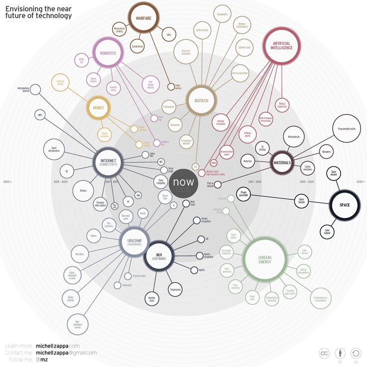

# 사전 질문 점검

작성일: 2023-09-04

> **목차**
>
> 1. [프로젝트 소개](#1-프로젝트-소개)
> 2. [검색 예시 보여드리기](#2-검색-예시-보여드리기)
>    1. [KMDb 영화 아카이브](#kmdb-영화-아카이브)
>    2. [맵](#맵)
> 3. [질문](#3-질문)
>    1. [설계](#설계)
>    2. [하둡 관련](#하둡-관련)
>    3. [기타](#기타)

# 1. 프로젝트 소개

프로젝트 소개

# 2. 검색 예시 보여드리기

## KMDb 영화 아카이브

## 맵

|  |  |
| ------------------------------------------- | ------------------------------------------- |

# 3. 질문

## 설계

- 데이터 수집부터 정규화, 서비스에 서빙하는 과정까지 전체 파이프라인을 설계할 때 어떤 점에 집중해서 하면 좋을까요?
- 비즈니스 로직이나 서비스 특성에 따라 기술 스택을 달리 선택해야 하는데(데이터 수집/데이터 처리/저장/운영), 비경험자가 서비스에 따라 기술 스택을 선정하는데 팁이 있을까요?
- 서비스 구조 상 RDB 사용이 불가피해 보이는데 Hadoop을 사용하는 의미가 있을지?

## 하둡 관련

- Hadoop을 현업에서 어떤 상황에 사용하는지?
  - 우리가 프로젝트에서는 어떻게 써보는게 좋을까요?
- 요즘은 하둡 대신 cloud DB를 사용하고 하둡이 레거시 기술스택이라고 하는데, SSAFY에서 하둡 프로젝트를 하는게 현업에서 도움이 될지?

## 기타

- 프로젝트를 진행하면서 분산기술 외에 추가로 적용 및 고민해볼 만한 기술적인 요소들이 궁금합니다!
- 어느 정도의 데이터 양부터 빅데이터로서의 의미가 있을까요?