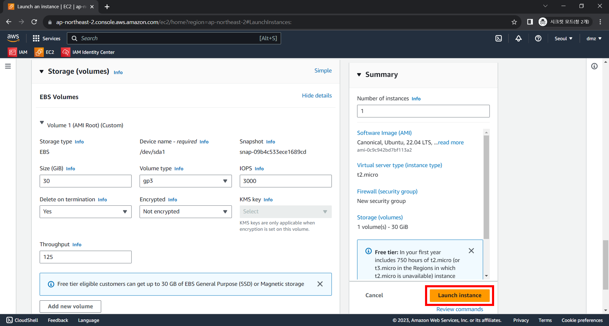

# 하둡 실습을 위한 EC2 발급

마지막 작성 날짜: 2023-09-12 <br>
작성자: 김예진

# 1. 구글 계정 및 AWS 계정 생성

프리티어 EC2 발급을 위해 구글 계정과 AWS 계정을 생성합니다. 이하 과정은 생략합니다. 

# 2. EC2 인스턴스 발급

1. ### EC2 페이지에서 `Launch instance` 클릭

   인스턴스를 생성하기 위한 region은 서울로 설정합니다.

    

2. ### 인스턴스 정보 설정

   이름을 입력합니다.

   
   
   운영체제는 우분투로 선택합니다.
   
   
   Key pair를 생성해줍니다. 저는 이전에 발급한 pem키를 사용하겠습니다.
   
   
   네트워킹 세팅은 다음과 같이 SSH, HTTPS, HTTP를 모두 허용해줍니다. SSH의 경우 custom으로 로컬 IP를 따로 지정해주어도 괜찮습니다.
   
   
   
   스토리지 설정에서는 EBS 볼륨을 30GB로 설정합니다(30GB가 프리티어 최대 용량입니다).
   
3. ### 인스턴스 생성
   `Launch instance` 버튼을 눌러 인스턴스를 생성합니다.
   
   
# 3. Elastic IP 연동


# 4. SSH 연결을 위한 로컬 설정

1. ### `config` 파일 수정

   Windows cmd에서는 `~/.ssh`로 이동할 수 없으니 git bash가 있다면 git bash를 활용하면 된다. 

   ```bash
   vi ~/.ssh/config
   ```

   다음과 같은 내용을 config에 추가한다.

   ```config
   Host Namenode
   	HostName <public DNS address of EC2 instance>
   	User ubuntu
   	IdentityFile ~/.ssh/<pem 파일명>
   ```

2. `ssh Namenode` 명령어를 통해 EC2에 접속

# 5. EC2 인스턴스 기본 설정

1. ### apt-get update

   ```bash
   sudo apt-get update
   ```

2. Root 비밀번호 생성

   ```bash
   sudo password root
   ```

3. 하둡 사용을 위한 새로운 유저 생성

   Root 계정으로 접속

   ```bash
   sudo su -
   ```
   새로운 유저 추가
   ```bash
   adduser hadoop
   ```
   Root 권한 부여

   ```bash
   usermod -aG sudo hadoop
   ```
   새로 추가한 계정의 권한 확인
   ```bash
   groups hadoop
   ```
   새로 추가한 유저로 계정 전환
   
   ```bash
   su hadoop
   ```
   
   
   
   
