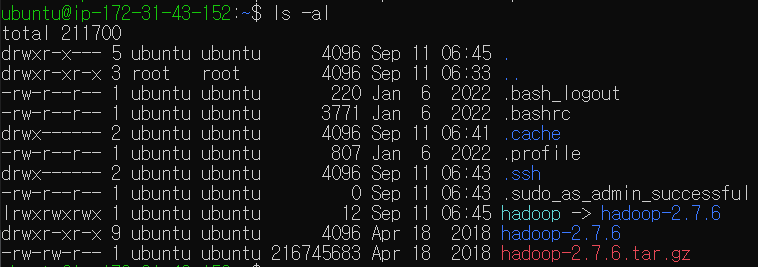
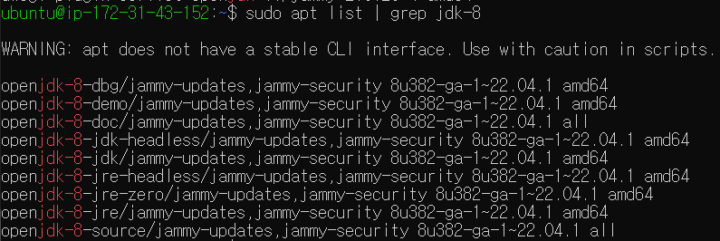
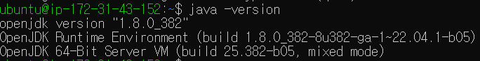
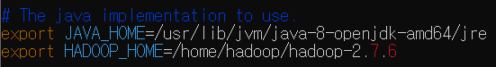
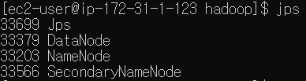
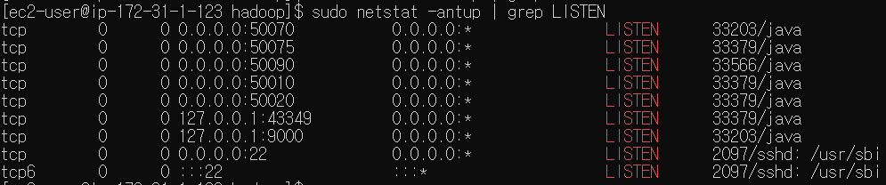
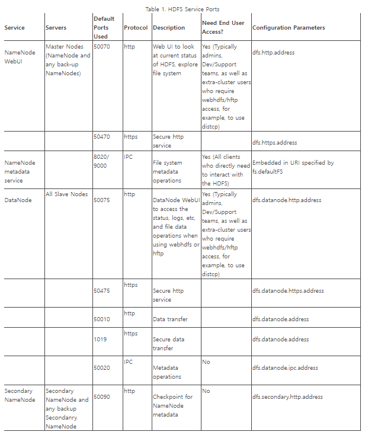

# EC2 위에 하둡 올리기

마지막 업데이트 날짜: 2023-09-11 <br>
작성자: 김예진

> **목차**
> 1. [Host에 localhost 추가](#host에-localhost-추가)
>    1. [SSH key pairs 생성](#ssh-key-paris-생성)
>    2. [Passwordless SHH 설정](#passwordless-shh-설정)
>    3. [Host에 localhost 추가](#host에-localhost-추가)
> 2. [하둡 설치](#2-하둡-설치)
>    1. [하둡 다운로드](#하둡-다운로드)
>    2. [압축 해제 및 symbolic link 생성](#압축-해제-및-symbolic-link-생성)
> 3. [하둡 초기 설정을 위한 자바 설치](#3-하둡-초기-설정을-위한-자바-설치)
>    1. [사용 가능한 자바 버전 확인](#사용-가능한-자바-버전-확인)
>    2.  [jdk 설치](#jdk-설치)
>    3. [Java 버전 확인](#java-버전-확인)
>    4. [JAVA_HOME 등록](#java_home-등록)
> 4. [하둡 초기 설정](#4-하둡-초기-설정)
>    1. [`etc/hadoop/hadoop-env.sh`에 HADOOP_HOME 환경변수 설정](#etchadoophadoop-envsh에-hadoop_home-환경변수-설정)
>    2. [`etc/hadoop/core-site.xml`에서 기본 파일 시스템 URI 수정](#etchadoopcore-sitexml에서-기본-파일-시스템-uri-수정)
>    3. [`etc/hadoop/hdfs-site.xml`에서 replica의 수를 1로, 기본 block 크기를 256MB로 설정](#etchadoophdfs-sitexml에서-replica의-수를-1로-기본-block-크기를-256mb로-설정)
>    4. [Namenode 포맷](#namenode-포맷)
> 5. [DFS 실행](#5-dfs-실행)
>    1. [DFS 실행](#dfs-실행)
>    2. [모든 데몬이 정상적으로 돌아가고 있는지 확인](#모든-데몬이-정상적으로-돌아가고-있는지-확인)
> 6. [기타. 하둡 관련](#기타-하둡-관련)
>    1. [하둡 데몬 관련 포트](#1-하둡-데몬-관련-포트)
>    2. [하둡 명령어](#2-하둡-명령어)

# 1. Host에 localhost 추가

1. ### SSH key paris 생성
   ```bash
   ssh-keygen -t rsa -P '' -f ~/.ssh/id_rsa
   ```

2. ### Passwordless SHH 설정
   만들어진 키를 authorized 파일에 추가함으로써 해당 키를 소유한 모든 시스템에 권한을 부여한다. 이를 통해 시스템과 원격 서버 간 비밀 번호 없는 인증이 가능해진다.
   ```bash
   cat ~/.ssh/id_rsa.pub >> ~/.ssh/authorized_keys
   chmod 0600 ~/./ssh/authorized_keys
   ```

3. ### Host에 localhost 추가
   ```bash
   ssh localhost
   ```


# 2. 하둡 설치

1. ### 하둡 다운로드
   ```bash
   wget https://archive.apache.org/dist/hadoop/common/hadoop-2.7.6/hadoop-2.7.6.tar.gz
   ```
2. ### 압축 해제 및 symbolic link 생성
   ```bash
   tar -xvf hadoop-2.7.6.tar.gz
   ln -s hadoop-2.7.6 hadoop
   ```
   

# 3. 하둡 초기 설정을 위한 자바 설치

1. ### 사용 가능한 자바 버전 확인
   ```bash
   sudo yum list | grep correto
   ```
   혹은 
   ```bash
   sudo yum list | grep jdk
   ```
   
2. ###  jdk 설치
   ```bash
   sudo yum install java-17-amazon-corretto.x86_64
   ```
3. ### Java 버전 확인
   ```bash
   java -version
   ```
   
4. `jps` 사용을 위한 ant 설치

   ```bash
   sudo yum install ant
   ```
5. ### JAVA_HOME 등록

   ```bash
   sudo vim /etc/profile
   ```
   ```shell
   export JAVA_HOME=/usr/lib/jvm/java-17-openjdk
   ```
   ```bash
   source /etc/profile
   ```

# 4. 하둡 초기 설정

1. ### `etc/hadoop/hadoop-env.sh`에 HADOOP_HOME 환경변수 설정
   
2. ### `etc/hadoop/core-site.xml`에서 기본 파일 시스템 URI 수정
   - Hadoop file system 명령어나 API를 이용해 하둡에 접근할 때 파일 시스템 URI를 지정하지 않으면 `localhost`의 `9000`번 포트를 이용해 HDFS 클러스터에 접근할 것임을 명시
   - 로컬에서의 개발, 혹은 테스트에서 흔히 하는 설정
   ```xml
   <configuration>
       <property>
           <name>fs.default.name</name>
           <value>hdfs://localhost:9000</value>
       </property>
   </configuration>
   ```
3. ### `etc/hadoop/hdfs-site.xml`에서 replica의 수를 1로, 기본 block 크기를 256MB로 설정
   ```xml
   <configuration>
       <property>
           <name>dfs.replication</name>
           <value>1</value>
       </property>
       <property>
           <name>dfs.block.size</name>
           <value>268435456</value>
       </property>
   </configuration>
   ```
4. ### Namenode 포맷
   ```bash
   bin/hadoop namenode -format
   ```

# 5. DFS 실행

1. ### DFS 실행
   ```bash
   ./sbin/start-dfs.sh
   ```
2. ### 모든 데몬이 정상적으로 돌아가고 있는지 확인

   ```bash
   jps
   ```
   
   ```bash
   sudo netstat -antup | grep LISTEN
   ```
   
   
   | port  | description                                                 |
   | ----- | ----------------------------------------------------------- |
   | 50070 | NameNodeWebUI                                               |
   | 50075 | DataNode                                                    |
   | 50090 | SecondaryNameNode                                           |
   | 50010 | DataNode(Data transfer)                                     |
   | 50020 | DataNode(Metadata operations)                               |
   | 9000  | NameNode metadata service (File system metadata operations) |
   

# 6. Local ↔HDFS 파일 교환 실습

1. ### HDFS에 user-specific directory 생성

   ```bash
   bin/hadoop fs -mkdir -p /user/ec2-user
   ```

2. ### HDFS에 파일 업로드 해보기

   ```bash
   bin/hadoop fs -put NOTICE.txt input
   ```

   

# 기타. 하둡 관련

## 1. 하둡 데몬 관련 포트

[HDFS service ports](https://docs.cloudera.com/HDPDocuments/HDP3/HDP-3.0.0/administration/content/hdfs-ports.html) 참고


## 2. 하둡 명령어
### help
```bash
bin/haddop fs -help
```

### Copy local file to HDFS

```bash
bin/hadoop fs -copyFromLocal <local 경로> <HDFS 경로>
```

```bash
bin/hadoop fs -put <local 경로> <HDFS 경로> 
```

### Copy HDFS file to local

```bash
bin/hadoop fs -copyToLocal <HDFS 경로> <local 경로>
```

### HDFS file listing

```bash
bin/hadoop fs -ls
```

### Local file listing

```bash
bin/hadoop fs -ls file://
```

### HDFS health check 1

```bash
bin/hadoop dfsadmin -report
```

### HDFS health check 2 - file and blocks

```bash
bin/hdfs fsck / -files -blocks
```

### HDFS health check 3

```bash
bin/hdfs dfs -stat "%b %F %g %n %o %r %u %y %Y" <file on HDFS>
```
- `stat`: file이나 directory의 metadata를 보여주는 명령어
- `%b`: Block size in bytes.
- `%F`: File type (file, directory, etc.).
- `%g`: Group of the file or directory.
- `%n`: File or directory name.
- `%o`: Owner of the file or directory.
- `%r`: Replication factor (number of replicas).
- `%u`: The user who accessed the file or directory.
- `%y`: Modification timestamp (in yyyy-MM-dd HH:mm:ss format).
- `%Y`: Modification timestamp in Unix timestamp (seconds since epoch) format.
