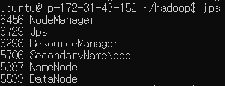
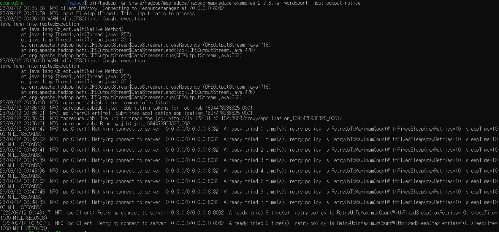

# MapReduce 실습하기

마지막 업데이트 날짜: 2023-09-11 <br>
작성자: 김예진

> **목차**
> 1. MapReduce 실행을 위한 YARN 설정
>    1. `etc/hadoop/mapred-site.xml`설정
>    2. `etc/hadoop/yarn-site.xml` 수정
>    3. YARN 실행
> 2. Hadoop에서 제공하는 기본 MapReduce 실행

# 1. MapReduce 실행을 위한 YARN 설정

1. ### `etc/hadoop/mapred-site.xml`설정
   MapReduce jobs 실행 시 YARN 프레임워크 위에서 YARN이 리소스 할당과 MapReduce 업무를 실행할 것임을 선언한다. 이 설정은 YARN이 다양한 워크로드 실행을 위한 더 나은 리소스 관리와 유연성을 제공하기 때문에 이 설정은 하둡 클러스터 설정 시 가장 일반적인 구성이 된다.
   ```xml
   <configuration>
       <property>
           <name>mapreduce.jobtracker.address</name>
           <value><your namenode public dns name>:54311</value>
       </property>
       <property>
           <name>mapreduce.framework.name</name>
           <value>yarn</value>
       </property>
   </configuration>
   ```
2. ### `etc/hadoop/yarn-site.xml` 수정
   YARN 자체는 MapReduce를 위해 만들어진 것이 아니기 때문에 Map 단계가 끝나고 Reduce로 넘어갈 때 Shuffle 과정을 YARN에서 실행하라는 설정을 따로 해야 한다.
   ```xml
   <configuration>
       <property>
           <name>yarn.nodemanager.aux-services</name>
           <value>mapreduce_shuffle</value>
       </property>
       <property>
           <name>yarn.nodemanager.aux-services.mapreduce.shuffle.class</name>
           <value>org.apache.hadoop.mapred.SuffleHandler</value>
       </property>
       <property>
           <name>yarn.resourcemanager.hostname</name>
           <value><your namenode public dns name></value>
       </property>
   </configuration>
   ```
3. ### YARN 실행
   ```bash
   ./sbin/start-yarn.sh
   ```
   ```bash
   jps
   ```
   

# 2. Hadoop에서 제공하는 기본 MapReduce 실행

```bash
hadoop jar share/hadoop/mapreduce/hadoop-mapreduce-examples-2.7.6.jar wordcount input output_notice
```

## 문제 발생 1



### 문제

- 하둡 측에서 제공하는 wordcount 예제를 실행하면 `java.lang.InterruptedException` 에러 발생
- `8032` 포트에 접근하지 못해 서버에 계속해서 연결하려는 시도 발생
- 강제로 하둡 실행을 종료할 수 없음 - 터미널이 뻗어버리거나, 어떤 설정(?)이 바뀌어서 아예 Namenode가 실행되지 않는 문제 발생함
  - Namenode format으로 문제를 해결했으나, 명령어 특성 탓에 모든 데이터 잃어버림
- 비정상적으로 코드가 종료되는 경우 EC2 밖으로 튕겨져 나오며, instance를 stop → start해야만 다시 접속할 수 있음
- EC2 위에서 하둡이 돌아가는지라 tunneling을 하지 않으면 윈도우 위에서 하둡이 돌아가는 상황을 모니터링할 수 없음

### 해결 과정

- `java.lang.InterupptedException`은 하둡 측에서 제공하는 [코드 내부에서의 에러](https://issues.apache.org/jira/browse/HDFS-10429)라고 함. 무시 가능하고, 본질적인 문제는 아님
- 인프런 강의에 해당 사항 문의 중
- 8032 포트에 연결할 수 없음 → yarn 실행에 문제 발생
- EC2 기본 사용자 이름이 `ubuntu`여서 발생한 문제이지 않을까 하는 의문이 듦
  - [여기](https://saturncloud.io/blog/how-to-add-ec2user-to-use-hadoop/)를 참조해 `ubuntu` 사용자도 Hadoop Group 내부에 포함시킴
  - `java.lang.InterupptedException` 발생 안 함
- [여기](https://medium.com/@ashwini130297/deploying-hadoop-cluster-on-aws-using-ec2-instances-bc845c35cc3)를 참조해 이것저것 다시 설정함
- org.apache.hadoop.hdfs.server.common.InconsistentFSStateException: Directory /tmp/hadoop-ubuntu/dfs/name is in an inconsistent state: storage directory does not exist or is not accessible.
  - [여기](https://stackoverflow.com/questions/27271970/hadoop-hdfs-name-is-in-an-inconsistent-state-storage-directoryhadoop-hdfs-data)를 참조해 문제 해결 시도 중
